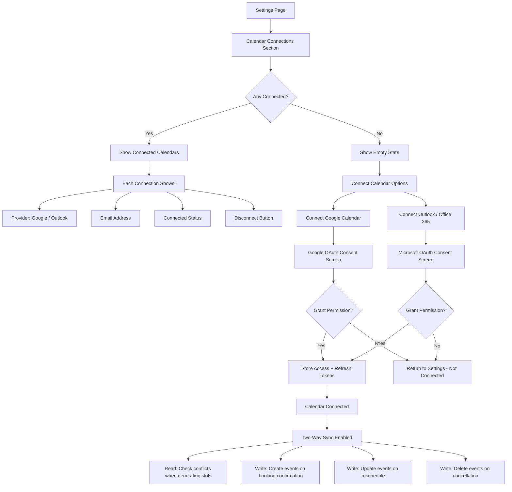
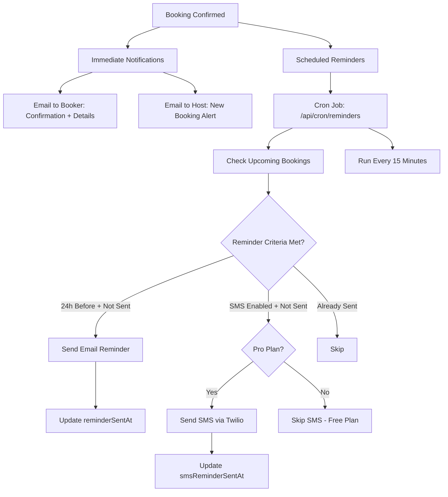
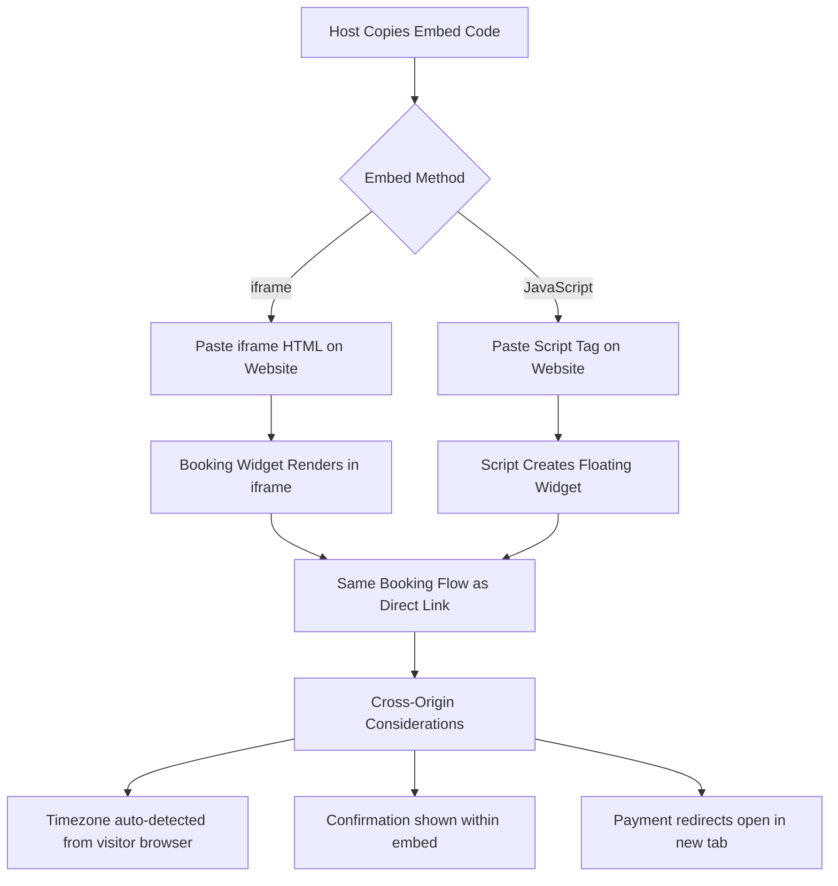

# Scheduling Feature - User Flows

## Overview

These user flows cover the complete scheduling experience for SchedulSign, based on the existing data model (Prisma schema) and implemented features. The flows address both the **host** (authenticated user managing events) and the **booker** (external visitor booking a time slot).

---

## 1. New User Onboarding Flow

```mermaid
flowchart TD
    A[Landing Page] --> B{Has Account?}
    B -->|No| C[Click "Get Started Free"]
    B -->|Yes| D[Click "Log In"]

    C --> E[Signup Page]
    E --> F{Auth Method}
    F -->|Email/Password| G[Enter Name + Email + Password]
    F -->|Google OAuth| H[Google Auth Flow]
    F -->|Outlook OAuth| I[Outlook Auth Flow]

    G --> J[Create Account]
    H --> J
    I --> J

    J --> K[Dashboard - Empty State]
    K --> L[Prompt: "Set your availability"]
    L --> M[Availability Page]
    M --> N[Configure Weekly Hours]
    N --> O[Save Availability]
    O --> P[Prompt: "Create your first event type"]
    P --> Q[Create Event Type Modal]
    Q --> R[Enter Title + Duration + Location]
    R --> S[Event Type Created]
    S --> T[Prompt: "Share your booking link"]
    T --> U[Copy Link / Preview Page]

    D --> V[Login Page]
    V --> W{Auth Method}
    W -->|Email/Password| X[Enter Credentials]
    W -->|Google| H
    W -->|Outlook| I
    X --> Y{Valid?}
    Y -->|Yes| K
    Y -->|No| Z[Show Error - Try Again]
    Z --> V
```

### Key Design Decisions
- Onboarding uses a progressive disclosure approach: availability first, then event type, then sharing
- Empty states guide users to the next logical action
- Google/Outlook OAuth auto-connects calendar for seamless setup
- URL slug is auto-generated from name but editable in Settings

---

## 2. Event Type Creation Flow

```mermaid
flowchart TD
    A[Dashboard / Event Types Page] --> B[Click "+ New Event Type"]
    B --> C[Create Event Type Modal]

    C --> D[Step 1: Basics]
    D --> D1[Enter Title]
    D --> D2[Select Duration: 15/30/45/60/90/120 min]
    D --> D3[Select Location Type]
    D --> D4[Enter Description - optional]

    D3 --> E{Location Type?}
    E -->|Google Meet| F[Auto-generate link on booking]
    E -->|Zoom| G[Auto-generate link on booking]
    E -->|Phone| H[Collect booker phone number]
    E -->|In Person| I[Enter address]
    E -->|Custom| J[Enter custom location text]

    D1 --> K[Click "Create"]
    K --> L[Event Type Created]
    L --> M[Redirect to Event Type Detail Page]

    M --> N[Advanced Settings - Optional]
    N --> N1[Buffer Before/After meetings]
    N --> N2[Daily/Weekly booking limits]
    N --> N3[Min notice period]
    N --> N4[Max future booking window]
    N --> N5[Require payment - set price]
    N --> N6[Custom questions]
    N --> N7[Brand color]
    N --> N8[Toggle active/inactive]

    N6 --> O[Add Custom Question]
    O --> O1[Enter Label]
    O --> O2[Select Type: Text/Textarea/Select/Radio/Checkbox/Phone/Email]
    O --> O3{Type = Select or Radio?}
    O3 -->|Yes| O4[Enter Options]
    O3 -->|No| O5[Set Required toggle]
    O4 --> O5
    O5 --> O6[Save Question]
    O6 --> O7{Add Another?}
    O7 -->|Yes| O
    O7 -->|No| P[Reorder Questions via Drag]

    N5 --> Q{Enable Payment?}
    Q -->|Yes| Q1[Enter Price]
    Q1 --> Q2[Select Currency]
    Q2 --> Q3[Stripe Connected?]
    Q3 -->|Yes| Q4[Payment Configured]
    Q3 -->|No| Q5[Prompt: Connect Stripe in Settings]
    Q -->|No| Q6[Free Booking]
```

### Key Design Decisions
- Two-phase creation: quick modal for basics, detail page for advanced settings
- Location type determines what additional info is needed and collected
- Custom questions support 7 input types for flexible intake forms
- Payment requires Stripe connection (handled in Settings)
- Buffer/limits prevent overbooking and protect host time

---

## 3. Availability Configuration Flow

```mermaid
flowchart TD
    A[Dashboard Sidebar] --> B[Click "Availability"]
    B --> C[Availability Page]

    C --> D[Weekly Schedule View]
    D --> E[For Each Day: Sun-Sat]
    E --> F{Day Enabled?}

    F -->|Enable| G[Set Start Time]
    G --> H[Set End Time]
    H --> I{Valid Range?}
    I -->|Yes| J[Time Saved Locally]
    I -->|No - End before Start| K[Show Validation Error]
    K --> G

    F -->|Disable| L[Mark as Unavailable]

    J --> M{More Days to Configure?}
    L --> M
    M -->|Yes| E
    M -->|No| N[Click "Save"]
    N --> O[PUT /api/availability]
    O --> P{Success?}
    P -->|Yes| Q[Show "Saved" Confirmation]
    P -->|No| R[Show Error Toast]

    C --> S[Date-Specific Override - Future Enhancement]
    S --> S1[Select Specific Date]
    S1 --> S2[Set Custom Hours or Block Entirely]
    S2 --> S3[Override Saved]
```

### Key Design Decisions
- Default Mon-Fri 9:00-17:00 for new users reduces setup friction
- Toggle-based enable/disable per day is intuitive
- Time inputs use native time pickers for consistency
- Date-specific overrides (supported by schema via `date` field) allow vacation/holiday handling
- All times stored relative to user's configured timezone

---

## 4. Public Booking Page Flow (Booker Perspective)

```mermaid
flowchart TD
    A[Booker Receives Link] --> B[Open /{username}/{eventSlug}]
    B --> C{Event Type Active?}
    C -->|No| D[Show "This event is no longer available"]
    C -->|Yes| E[Load Booking Widget]

    E --> F[Display: Host Info + Event Details]
    F --> F1[Host name + avatar/logo]
    F --> F2[Event title + description]
    F --> F3[Duration + Location type]
    F --> F4[Price if paid event]

    E --> G[Auto-detect Booker Timezone]
    G --> H[Timezone Selector - changeable]

    E --> I[Calendar View - Current Month]
    I --> J[Select a Date]
    J --> K{Date Valid?}
    K -->|Past Date| L[Disabled - Cannot Select]
    K -->|Beyond maxFutureDays| L
    K -->|Valid| M[Fetch Available Slots]

    M --> N[GET /api/slots?eventTypeId=...&date=...&timezone=...]
    N --> O[Slot Calculation]
    O --> O1[Check host availability rules]
    O --> O2[Check calendar conflicts - Google/Outlook]
    O --> O3[Apply buffer before/after]
    O --> O4[Apply min notice period]
    O --> O5[Check daily/weekly limits]

    O --> P{Slots Available?}
    P -->|No| Q[Show "No available times"]
    P -->|Yes| R[Display Time Slots]

    R --> S[Booker Clicks a Time]
    S --> T[Slot Highlighted - "Confirm ->"]
    T --> U[Booker Clicks Again to Confirm]
    U --> V[Booking Form Step]

    V --> W[Enter Name - required]
    V --> X[Enter Email - required]
    V --> Y[Enter Phone - optional]
    V --> Z[Answer Custom Questions]

    Z --> AA[Click "Confirm Booking"]
    AA --> AB{Payment Required?}
    AB -->|Yes| AC[Redirect to Stripe Checkout]
    AC --> AD{Payment Successful?}
    AD -->|Yes| AE[Booking Created - CONFIRMED]
    AD -->|No| AF[Payment Failed - Show Error]
    AF --> AC

    AB -->|No| AE

    AE --> AG[Confirmation Screen]
    AG --> AG1[Show date/time/timezone]
    AG --> AG2[Show meeting link if virtual]
    AG --> AG3[Show reschedule link]
    AG --> AG4[Show cancel link]

    AE --> AH[Send Confirmation Email to Booker]
    AE --> AI[Send Notification Email to Host]
    AE --> AJ[Create Calendar Event]
    AE --> AK[Fire Webhook: booking.created]
    AE --> AL[Auto-create Contact if new]
```

### Key Design Decisions
- Two-click slot selection (select, then confirm) prevents accidental bookings
- Timezone auto-detection with manual override respects international bookers
- Slot availability is calculated server-side considering all constraints
- Payment flow redirects to Stripe Checkout for PCI compliance
- Post-booking actions (email, calendar, webhook, contact) happen asynchronously
- Confirmation page provides immediate reschedule/cancel options

---

## 5. Booking Management Flow (Host Perspective)

```mermaid
flowchart TD
    A[Dashboard] --> B[Click "Bookings" in Sidebar]
    B --> C[Bookings Page]

    C --> D[Filter Tabs]
    D --> D1[Upcoming - default]
    D --> D2[Past]
    D --> D3[Cancelled]
    D --> D4[All]

    C --> E[Booking List]
    E --> F[Each Booking Shows:]
    F --> F1[Title / Event Type]
    F --> F2[Date + Time Range]
    F --> F3[Booker Name + Email]
    F --> F4[Meeting Link if virtual]
    F --> F5[Status Badge]

    F5 --> G{Status}
    G -->|CONFIRMED| H[Green Badge]
    G -->|CANCELLED| I[Red Badge]
    G -->|RESCHEDULED| J[Yellow Badge]
    G -->|COMPLETED| K[Gray Badge]
    G -->|NO_SHOW| L[Gray Badge]

    E --> M[Click on Booking - Future Detail View]
    M --> N[Booking Detail]
    N --> N1[Full booker info]
    N --> N2[Custom question answers]
    N --> N3[Payment status]
    N --> N4[Meeting link]
    N --> N5[Cancel / Reschedule actions]
```

### Key Design Decisions
- Filter tabs provide quick access to relevant booking subsets
- "Upcoming" is the default view since it is the most actionable
- Status badges use color coding for instant visual recognition
- Meeting links are directly clickable for quick joins

---

## 6. Booking Cancellation Flow

```mermaid
flowchart TD
    A[Booker Clicks Cancel Link] --> B[Open /cancel/{uid}]
    B --> C{Booking Exists?}
    C -->|No| D[Show "Booking not found"]
    C -->|Yes| E{Already Cancelled?}
    E -->|Yes| F[Show "Already cancelled"]
    E -->|No| G[Show Booking Details]

    G --> H[Enter Cancellation Reason - optional]
    H --> I[Click "Cancel Booking"]
    I --> J[POST /api/bookings/{uid}/cancel]
    J --> K[Update Status to CANCELLED]
    K --> L[Cancel Calendar Event]
    K --> M[Send Cancellation Email to Host]
    K --> N[Send Cancellation Email to Booker]
    K --> O[Fire Webhook: booking.cancelled]
    K --> P{Was Paid?}
    P -->|Yes| Q[Initiate Stripe Refund]
    P -->|No| R[Done]
    Q --> R

    R --> S[Show Cancellation Confirmation]
    S --> T[Option: Rebook with Same Host]
```

---

## 7. Booking Reschedule Flow

```mermaid
flowchart TD
    A[Booker Clicks Reschedule Link] --> B[Open /reschedule/{uid}]
    B --> C{Booking Exists?}
    C -->|No| D[Show "Booking not found"]
    C -->|Yes| E{Can Reschedule?}
    E -->|Cancelled/Completed| F[Show "Cannot reschedule"]
    E -->|Yes| G[Load Booking Widget with Context]

    G --> H[Show: "Rescheduling: Original Date/Time"]
    H --> I[Same Calendar + Slot Selection Flow]
    I --> J[Select New Date]
    J --> K[Select New Time Slot]
    K --> L[Confirm New Time]

    L --> M[POST /api/bookings/{uid}/reschedule]
    M --> N[Original Booking Status -> RESCHEDULED]
    M --> O[New Booking Created with rescheduleUid link]
    M --> P[Update Calendar Events]
    M --> Q[Send Reschedule Emails]
    M --> R[Fire Webhook: booking.rescheduled]

    R --> S[Show Confirmation with New Time]
```

### Key Design Decisions
- Reschedule reuses the booking widget for consistency
- Original booking is marked RESCHEDULED and linked to new booking
- No need to re-enter personal info (name/email carried over)
- Calendar events are updated automatically

---

## 8. Calendar Integration Flow



### Key Design Decisions
- Google OAuth handled via NextAuth integration
- Outlook OAuth uses custom route (/api/auth/outlook)
- Tokens stored encrypted in CalendarConnection model
- Conflict checking queries connected calendars when generating available slots
- Multiple calendars can be connected (one set as primary)

---

## 9. Collective (Group) Scheduling Flow

```mermaid
flowchart TD
    A[Create/Edit Event Type] --> B[Enable "Collective Scheduling"]
    B --> C[Add Team Member User IDs]
    C --> D[Event Type Saved with collectiveMembers]

    D --> E[Booker Opens Booking Page]
    E --> F[Slot Generation]
    F --> G[Check Availability for ALL Members]
    G --> G1[Host availability rules]
    G --> G2[Member 1 calendar conflicts]
    G --> G3[Member 2 calendar conflicts]
    G --> G4[...Member N]

    G --> H[Show Only Times ALL Members Are Free]
    H --> I[Booker Selects Slot + Books]
    I --> J[Calendar Events Created for ALL Members]
    J --> K[Meeting Link Shared with All]
```

### Key Design Decisions
- Collective scheduling finds intersection of all members' availability
- All members receive calendar invites
- Fewer available slots expected; communicate this to booker
- Useful for sales calls, panel interviews, team consultations

---

## 10. Notification & Reminder Flow



### Key Design Decisions
- Email reminders sent 24 hours before (configurable in future)
- SMS reminders are a Pro-plan feature (via Twilio)
- Cron endpoint handles batch processing of due reminders
- Idempotent: tracks sentAt timestamps to prevent duplicates

---

## 11. Embed Widget Flow



---

## 12. Webhook Integration Flow

```mermaid
flowchart TD
    A[Settings or Webhooks Page] --> B[Click "Add Webhook"]
    B --> C[Enter Webhook URL]
    C --> D[Select Events to Subscribe]
    D --> D1[booking.created]
    D --> D2[booking.cancelled]
    D --> D3[booking.rescheduled]
    D --> D4[booking.completed]

    C --> E[Auto-generate Secret Key]
    E --> F[Save Webhook]

    F --> G[On Matching Event]
    G --> H[POST to Webhook URL]
    H --> H1[Include event payload as JSON]
    H --> H2[Include HMAC signature header]
    H --> I{Response?}
    I -->|2xx| J[Delivery Successful]
    I -->|Error/Timeout| K[Log Failure]
```

---

## Error States & Edge Cases

### Booking Conflicts
- If a slot becomes unavailable between selection and confirmation (race condition), show: "This time is no longer available. Please select another time."
- Re-fetch slots and display updated availability.

### Expired Sessions
- If host session expires during dashboard use, redirect to login with return URL.
- Preserve any unsaved form data in localStorage where possible.

### Payment Failures
- If Stripe checkout is abandoned, booking remains in PENDING status.
- Cron job can clean up stale PENDING bookings after 30 minutes.

### Calendar Sync Failures
- If calendar token is expired, attempt refresh.
- If refresh fails, notify host to re-connect calendar.
- Booking still proceeds; calendar event creation is best-effort.

### Rate Limiting
- Public booking endpoints should be rate-limited to prevent abuse.
- Daily/weekly limits on event types provide host-side protection.

### Mobile Considerations
- Booking widget is responsive (md:flex breakpoint in existing code).
- Calendar grid scales down; time slots stack vertically on mobile.
- Form inputs use appropriate mobile types (tel, email).
- Touch targets are minimum 44x44px.

---

## Flow Summary Table

| Flow | Primary User | Entry Point | Happy Path Steps | Key Edge Cases |
|------|-------------|-------------|-----------------|----------------|
| Onboarding | Host | Landing Page | 6 | OAuth failures, duplicate email |
| Event Type Creation | Host | Dashboard | 3-5 | Missing required fields |
| Availability Config | Host | Dashboard | 3 | Invalid time ranges |
| Public Booking | Booker | Shared Link | 5 | No slots, payment failure |
| Booking Management | Host | Dashboard | 2 | No bookings (empty state) |
| Cancellation | Booker | Email Link | 3 | Already cancelled, refund |
| Reschedule | Booker | Email Link | 4 | No alternative slots |
| Calendar Integration | Host | Settings | 3 | OAuth denied, token expiry |
| Collective Scheduling | Host/Booker | Booking Page | 5 | No common availability |
| Notifications | System | Cron/Event | Automatic | SMS plan restriction |
| Embed | Host | Settings | 2 | Cross-origin issues |
| Webhooks | Host | Dashboard | 3 | Delivery failures |
