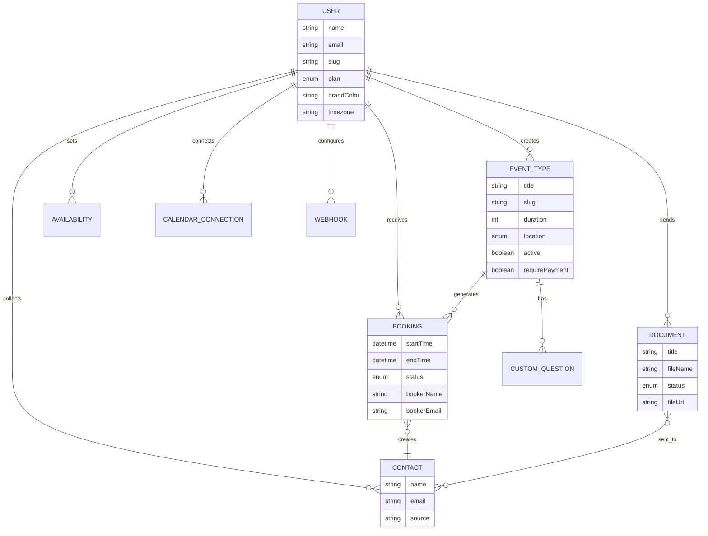

# SchedulSign - Information Architecture & Sitemap

## Overview

This document defines the complete information architecture for SchedulSign, mapping all pages, their relationships, access levels, and navigation structure. It is based on the existing Next.js App Router file structure and the planned e-signature module.

---

## 1. Complete Sitemap

```mermaid
graph TD
    ROOT[schedulsign.com]

    ROOT --> PUB[Public Pages]
    ROOT --> AUTH[Auth Pages]
    ROOT --> DASH[Dashboard - Authenticated]
    ROOT --> BOOK[Public Booking]
    ROOT --> SIGN[Public Signing]
    ROOT --> API[API Routes]

    %% Public Pages
    PUB --> LP[/ Landing Page]
    PUB --> PRIV[/privacy Privacy Policy]
    PUB --> TERMS[/terms Terms of Service]

    %% Auth Pages
    AUTH --> LOGIN[/login]
    AUTH --> SIGNUP[/signup]

    %% Public Booking
    BOOK --> UPAGE[/:username User Profile Page]
    UPAGE --> EPAGE[/:username/:eventSlug Booking Widget]
    BOOK --> CANCEL[/cancel/:uid Cancel Booking]
    BOOK --> RESCHED[/reschedule/:uid Reschedule Booking]

    %% Public Signing
    SIGN --> SIGNPAGE[/sign/:token Document Signing Page]
    SIGN --> SIGNDONE[/sign/:token/done Signing Complete]

    %% Dashboard
    DASH --> DOVER[/dashboard Overview]
    DASH --> DEVT[/dashboard/event-types Event Types List]
    DEVT --> DEVTD[/dashboard/event-types/:id Event Type Detail/Edit]
    DASH --> DBOOK[/dashboard/bookings Bookings List]
    DASH --> DAVAIL[/dashboard/availability Availability Config]
    DASH --> DDOCS[/dashboard/documents Documents List]
    DDOCS --> DDOCD[/dashboard/documents/:id Document Detail]
    DDOCS --> DDOCP[/dashboard/documents/new/prepare Document Preparation]
    DASH --> DTEMP[/dashboard/templates Templates List]
    DTEMP --> DTEMPD[/dashboard/templates/:id Template Detail]
    DASH --> DCONT[/dashboard/contacts Contacts List]
    DASH --> DWEBH[/dashboard/webhooks Webhooks]
    DASH --> DSET[/dashboard/settings Settings]

    %% API Routes
    API --> AAUTH[/api/auth/* NextAuth + Outlook OAuth]
    API --> AEVT[/api/event-types Event Types CRUD]
    API --> ABOOK[/api/bookings Bookings CRUD]
    API --> ASLOTS[/api/slots Slot Availability]
    API --> AAVAIL[/api/availability Availability CRUD]
    API --> ACONT[/api/contacts Contacts CRUD]
    API --> AWEBH[/api/webhooks Webhooks CRUD]
    API --> AUSER[/api/user User Profile]
    API --> ASTRIPE[/api/stripe/* Payments]
    API --> ACRON[/api/cron/reminders Reminders Cron]
    API --> ADOCS[/api/documents Documents CRUD]
    API --> ASIGN[/api/sign/* Signing Actions]
    API --> AV1[/api/v1/* Public API]
```

---

## 2. Navigation Structure

### 2.1 Top Navigation Bar (All Pages)

| Element | Unauthenticated | Authenticated |
|---------|----------------|---------------|
| Logo | Link to / | Link to /dashboard |
| User Email | Hidden | Displayed |
| Log In | Shown | Hidden |
| Get Started | Shown | Hidden |
| Log Out | Hidden | Shown |

### 2.2 Dashboard Sidebar Navigation

```
Overview           /dashboard                  LayoutDashboard icon
Event Types        /dashboard/event-types      Calendar icon
Bookings           /dashboard/bookings         Clock icon
Availability       /dashboard/availability     Clock icon
Documents          /dashboard/documents        FileSignature icon
Templates          /dashboard/templates        FileText icon
Contacts           /dashboard/contacts         Users icon
Webhooks           /dashboard/webhooks         Webhook icon
Settings           /dashboard/settings         Settings icon
```

**Navigation grouping:**

```
SCHEDULING
  Event Types
  Bookings
  Availability

SIGNATURES
  Documents
  Templates

MANAGEMENT
  Contacts
  Webhooks
  Settings
```

### 2.3 Mobile Navigation

On screens below `md` breakpoint:
- Sidebar collapses to bottom tab bar or hamburger menu
- Show 5 primary items: Overview, Events, Bookings, Documents, Settings
- "More" menu for secondary items: Availability, Templates, Contacts, Webhooks

---

## 3. Page Inventory

### 3.1 Public Pages

| Page | Route | Purpose | Key Components |
|------|-------|---------|---------------|
| Landing Page | `/` | Marketing, conversion | Hero, Features, Pricing, CTA |
| Privacy Policy | `/privacy` | Legal requirement | Static content |
| Terms of Service | `/terms` | Legal requirement | Static content |

### 3.2 Authentication Pages

| Page | Route | Purpose | Key Components |
|------|-------|---------|---------------|
| Login | `/login` | User authentication | Email/password form, OAuth buttons |
| Signup | `/signup` | New user registration | Name/email/password form, OAuth buttons |

### 3.3 Public Booking Pages

| Page | Route | Purpose | Key Components |
|------|-------|---------|---------------|
| User Profile | `/:username` | List of user's active event types | Event type cards, host info |
| Booking Widget | `/:username/:eventSlug` | Book a meeting | Calendar, time slots, booking form |
| Cancel Booking | `/cancel/:uid` | Cancel an existing booking | Booking details, cancel form |
| Reschedule Booking | `/reschedule/:uid` | Reschedule an existing booking | Calendar, time slots (pre-filled info) |

### 3.4 Public Signing Pages

| Page | Route | Purpose | Key Components |
|------|-------|---------|---------------|
| Document Signing | `/sign/:token` | Sign a document | PDF viewer, signature fields, consent |
| Signing Complete | `/sign/:token/done` | Confirmation after signing | Success message, download link |

### 3.5 Dashboard Pages

| Page | Route | Purpose | Key Components |
|------|-------|---------|---------------|
| Overview | `/dashboard` | Summary stats and upcoming items | Stat cards, upcoming bookings, pending signatures |
| Event Types | `/dashboard/event-types` | Manage event types | List, create modal, copy link, delete |
| Event Type Detail | `/dashboard/event-types/:id` | Edit event type settings | All settings tabs, custom questions, preview |
| Bookings | `/dashboard/bookings` | View and manage bookings | Filter tabs, booking list, actions |
| Availability | `/dashboard/availability` | Set weekly availability | Day toggles, time inputs, save |
| Documents | `/dashboard/documents` | Manage sent documents | Filter tabs, document list, actions |
| Document Detail | `/dashboard/documents/:id` | View document status and audit trail | PDF preview, recipient status, audit log |
| Document Preparation | `/dashboard/documents/new/prepare` | Place fields on uploaded document | PDF viewer, field toolbar, recipient panel |
| Templates | `/dashboard/templates` | Manage reusable templates | Template list, create, use |
| Template Detail | `/dashboard/templates/:id` | View/edit template | PDF preview, field positions, roles |
| Contacts | `/dashboard/contacts` | View contacts from bookings/signatures | Contact list, search, source filter |
| Webhooks | `/dashboard/webhooks` | Manage webhook subscriptions | Webhook list, create, events selector |
| Settings | `/dashboard/settings` | Profile, branding, billing, integrations | Profile form, calendar connections, subscription, embed |

---

## 4. Access Control Matrix

| Route Pattern | Unauthenticated | Free Plan | Pro Plan |
|--------------|----------------|-----------|----------|
| `/` | Full access | Full access | Full access |
| `/login`, `/signup` | Full access | Redirect to dashboard | Redirect to dashboard |
| `/:username/:eventSlug` | Full access | Full access | Full access |
| `/cancel/:uid` | Full access | Full access | Full access |
| `/reschedule/:uid` | Full access | Full access | Full access |
| `/sign/:token` | Full access | Full access | Full access |
| `/dashboard/*` | Redirect to login | Full access | Full access |
| Event Types | - | 1 event type limit | Unlimited |
| Documents (send) | - | 3 sends/month | Unlimited |
| SMS Reminders | - | Not available | Available |
| Custom Branding | - | Default only | Customizable |
| Payment Collection | - | Not available | Available |
| Webhooks & API | - | Not available | Available |

---

## 5. Data Relationships & Content Model



---

## 6. URL Naming Conventions

| Pattern | Example | Convention |
|---------|---------|-----------|
| Dashboard pages | `/dashboard/event-types` | Plural nouns, kebab-case |
| Detail pages | `/dashboard/event-types/:id` | Singular resource by ID |
| Public pages | `/:username/:eventSlug` | User-friendly slugs |
| Action pages | `/cancel/:uid` | Verb + identifier |
| API routes | `/api/event-types` | Plural nouns, REST conventions |
| API actions | `/api/bookings/:uid/cancel` | Resource + action |
| Public API | `/api/v1/bookings` | Versioned prefix |

---

## 7. Search & Filtering Architecture

### Dashboard Overview
- No search needed (summary page)

### Event Types
- No search (typically < 20 items)
- Sort by: created date (default), title, booking count

### Bookings
- Filter by: upcoming, past, cancelled, all
- Future: search by booker name/email, date range picker

### Documents
- Filter by: all, action required, waiting, completed, voided
- Search by: title, recipient name, recipient email

### Contacts
- Search by: name, email, company
- Filter by source: booking, signature, manual

### Templates
- Search by: name
- Filter by category

---

## 8. Dashboard Overview - Widget Layout

The dashboard overview page should provide a snapshot of both scheduling and e-signature activity:

```
+-------------------------------------------+
|  STATS ROW                                |
|  [Event Types: 5] [Upcoming: 12] [Docs: 3]|
|  [Contacts: 45]  [Pending Sigs: 2]        |
+-------------------------------------------+
|                    |                       |
|  UPCOMING BOOKINGS |  PENDING SIGNATURES   |
|  (next 5)          |  (awaiting action)    |
|                    |                       |
|  - Meeting w/ John |  - Contract for Jane  |
|  - Call w/ Sarah   |  - NDA for Acme Corp  |
|  - Demo w/ Alex    |                       |
|                    |                       |
|  [View All ->]     |  [View All ->]        |
+-------------------------------------------+
|  RECENT ACTIVITY                          |
|  - John signed Contract.pdf               |
|  - New booking: Sarah @ 2pm               |
|  - Reminder sent to Alex                  |
+-------------------------------------------+
```

---

## 9. Empty States

Every list page should have a purposeful empty state:

| Page | Empty State Message | CTA |
|------|-------------------|-----|
| Event Types | "No event types yet" | "Create your first event type" |
| Bookings | "No bookings yet. Share your booking link to get started." | "Go to Event Types" |
| Documents | "No documents yet. Upload a document to send for signing." | "New Document" |
| Templates | "No templates yet. Save time by creating reusable templates." | "Create Template" |
| Contacts | "Contacts appear here automatically from bookings and signatures." | "Create Event Type" |
| Webhooks | "No webhooks configured. Connect external services to SchedulSign." | "Add Webhook" |
| Availability | (Pre-filled with Mon-Fri 9-5 defaults, never truly empty) | N/A |

---

## 10. Breadcrumb Navigation

For nested pages, breadcrumbs provide context and navigation:

```
Dashboard > Event Types > 30 Minute Meeting
Dashboard > Documents > Contract for Jane Doe
Dashboard > Templates > Standard NDA
Dashboard > Settings
```

Breadcrumbs are shown on detail pages only, not on top-level dashboard pages.

---

## 11. Notification & Alert Placement

| Notification Type | Placement | Duration |
|------------------|-----------|----------|
| Success (save, create) | Top-right toast | 3 seconds auto-dismiss |
| Error (API failure) | Top-right toast | Persist until dismissed |
| Validation error | Inline below field | Persist until fixed |
| Confirmation dialog | Centered modal | User must respond |
| Plan upgrade prompt | Inline banner or modal | Persist / dismissible |
| Empty state guidance | In content area | Persist until content exists |

---

## 12. Responsive Breakpoints

| Breakpoint | Width | Layout Changes |
|-----------|-------|---------------|
| Mobile | < 768px | Single column, bottom nav, stacked cards |
| Tablet | 768-1024px | Sidebar visible, 2-column grids |
| Desktop | > 1024px | Full sidebar, 3-column stat cards, side-by-side panels |

Key responsive considerations:
- Sidebar collapses below `md` (768px) - existing behavior
- Booking widget stacks info panel above calendar on mobile - existing behavior
- Document preparation view: field toolbar moves to bottom sheet on mobile
- Signing view: fields navigated via "Next" button on mobile instead of scrolling
